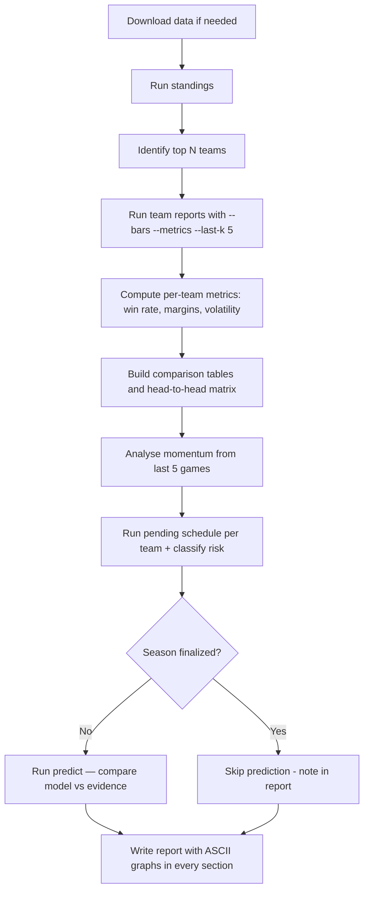

# Skill: League Top-N Team Analysis

Analyse the top **N** teams in a basketball league using the `korb` CLI package in this workspace.

Goal: produce an evidence-based report that answers **who leads now**, **why they're strong** (offense/defense/margins), **how stable** the ranking seems (over/under-performance risk), and **which pending games** most affect the top-N finish. The report **must include ASCII-based graphs** for visual clarity.

## Prerequisites

- Python 3 available as `python3`
- HTML data files present (results + schedule) — run `uv run korb download <liga_id>` to fetch them
- The `korb` package in the workspace with subcommands: `standings`, `team`, `schedule`, `predict`, `top`, `download`
- Supports `--json` flag for machine-readable output on all subcommands

## Inputs

| Variable | Default | Description |
|---|---|---|
| `N` | `3` | Number of top teams to analyse |
| `LIGA_ID` | — | Liga ID from the DBB URL (used by `download` + to locate `files/<LIGA_ID>/...`) |
| `REPORT_FILE` | `topn_report.md` | Output markdown report filename (path relative to workspace) |
| `LANGUAGE` | `en` | Report language: `en` (English), `de` (German), `es` (Spanish) |
| `RESULTS_DIR` | `files/<LIGA_ID>` | Directory containing `ergebnisse.html` and `spielplan.html` |

---

## Phase 0 — Download fresh data (if needed)

> **Missing inputs rule.** If `LIGA_ID`, `REPORT_FILE`, or `LANGUAGE` are not provided by the user, ask the user before continuing:
> 1) `LIGA_ID` (Liga ID)
> 2) `REPORT_FILE` (output filename/path)
> 3) `LANGUAGE` (`en`, `de`, `es`)

Check whether `files/<LIGA_ID>/ergebnisse.html` and `files/<LIGA_ID>/spielplan.html` exist and are recent. If not, download them:

```bash
uv run korb download <LIGA_ID>
```

This fetches both results and schedule HTML from basketball-bund.net and saves them into `files/<LIGA_ID>/`. Skip this phase if the data files are already up to date.

---

## Phase 1 — Identify the top N teams

Run:

```bash
uv run korb standings --liganr <LIGA_ID>
```

Record the **top N teams** by rank. For each, capture:

- rank, games played, W / L / D
- points for (PF), points against (PA), point differential
- standings points (2 per win, 1 per draw, 0 per loss)
- scoring averages (Avg PF, Avg PA)

Compute *comparative signals* directly from the table:
- **Pts gap:** difference in standings points between consecutive top-N teams
- **Diff gap:** difference in point differential between consecutive teams
- **Tightness:** if top-N are close in Pts and Diff, treat ordering as **margin-sensitive**

Tie-breaking priority: **standings points → point differential → points for** (see `calculate_standings()` in `korb/standings.py`).

Store the N team names for all subsequent steps. Use **partial name tokens** that uniquely match each team (CLI does case-insensitive partial matching).

---

## Phase 2 — Pull each team's full game profile

For each of the N teams, run:

```bash
uv run korb team "<PARTIAL_NAME>" --bars --metrics --last-k 5 --liganr <LIGA_ID>
```

> **Tip:** Add `--json` for structured data: `uv run korb --json team "<PARTIAL_NAME>"`

Extract per team:

- full list of wins and losses with scores
- margin patterns from the bar chart (concentration of strong wins vs volatility)
- record consistency (streaks; how many losses are "close" vs "blowouts")
- computed metrics:
  - **win rate** = wins / games played
  - **blowout wins** = wins with margin ≥ 15
  - **close wins** = wins with margin ≤ 5
  - **close losses** = losses with margin ≤ 5
  - **avg win margin** = mean differential in wins only
  - **avg loss margin** = mean differential in losses only
  - **volatility** = standard deviation of all game differentials
  - **last-5 record** = W-L in most recent 5 games (momentum proxy)
- whether success is driven by **sustained differential** or **narrow conversion**

---

## Phase 3 — Build the comparison

### 3.1 Table strength

Compare across the N teams:

- total standings points
- games played (identify if any team has games in hand)
- point differential and points-for as tie-break factors

Classify each team:
- **Front-runner:** high Pts and strong Diff with few close losses
- **Defensive grinder:** best PA profile + wins by controlled margins
- **High-ceiling scorer:** strongest PF/Avg PF, check fragility via heavy losses
- **Volatile contender:** high PF but also high PA, unpredictable results

### 3.2 Results profile comparison

Compare:

- win rate
- average offensive output
- average defensive concession
- blowout win frequency (margin ≥ 15)
- close win frequency (margin ≤ 5)
- close loss frequency (margin ≤ 5)
- extreme results frequency (|diff| ≥ 30)

### 3.3 Head-to-head among the top N

> **Manual step.** Cross-reference opponents in each team's Phase 2 output.

Create a mini round-robin table with:

- head-to-head record (W-L per pairing)
- cumulative point differential in those games
- home/away splits if available
- which team produced the larger margin in each leg

Weight this section heavily — direct matchups are the strongest signal.

### 3.4 Momentum / form

Games are returned newest-first by `read_games()`. Review recent sequence for:

- current winning or losing streaks
- whether recent results reinforce or contradict the full-season table
- whether losses came against fellow contenders or weaker opposition

Momentum rules:
- Recent **not-close** losses (large negative margins) → **real regression risk**
- Recent **narrow** losses (0 to −5) → **normalization candidate** (could swing back)
- Winning streak against mixed opposition → **strong form signal**

### 3.5 Remaining schedule risk

Run the global pending query, then per-team:

```bash
uv run korb schedule --pending --liganr <LIGA_ID>
uv run korb schedule --pending --team "<PARTIAL_NAME>" --liganr <LIGA_ID>
```

> **Date-sensitivity warning.** `filter_schedule()` compares against `datetime.now()`. If the season data is historical, `--pending` may return zero games. In that case, run `uv run korb schedule` without `--pending` and manually cross-reference.

Classify each pending game as:

- **likely win** — opponent is significantly weaker (bottom third of table)
- **toss-up** — opponent is mid-table or close in strength
- **decisive head-to-head** — opponent is another top-N contender

Check for **back-to-back** scheduling (games within 36 hours) — the prediction model applies a fatigue penalty for these.

Control-of-finish heuristic:
- A team has control if they have multiple "likely win" games left and at most 1–2 "decisive" games
- If top-N fate depends on a couple of head-to-head fixtures, the finish is **coupled** to that pairing

---

## Phase 4 — Prediction

> **Season-finalized check.** Before running predictions, verify the season is still active:
>
> ```bash
> uv run korb schedule --pending --liganr <LIGA_ID>
> ```
>
> If no pending games are listed, the season is finalized. **Skip this phase** and note in the report that predictions are unavailable because the season has concluded.

Run (only if season is active):

```bash
uv run korb predict --liganr <LIGA_ID>
```

### Model features to reference

| Parameter | Value | Effect |
|---|---|---|
| Recency half-life | 60 days | Recent games weighted more heavily |
| Recent form blend | Last 5 games at 30% weight | Hot/cold streaks shift ratings |
| Home advantage | 3% symmetric boost | Home team scores slightly more, away slightly less |
| Back-to-back fatigue | 5% penalty within 36h | Offense drops, defense weakens for fatigued team |
| Small-sample blend | Teams with < 3 games regress to avg | Prevents wild predictions on thin data |
| Tie-breaking | No draws allowed | Basketball has overtime; ties broken by raw score or home edge |

Because the model is deterministic (no upset probability), it always predicts the favourite. Close matchups may appear decisive when they're actually coin-flip games. Treat predictions as **directional, not certain**.

After reviewing prediction output, state whether you agree and explain why based on Phases 1–3.

Reconciliation checks:
- Does predicted ordering track **Diff strength** more than **recent form**?
- Are predicted margins plausible given blowout/close metrics?
- If ranks jump, identify the *single* remaining-fixture mechanism driving the change

---

## Phase 5 — Write the report

Produce a markdown report file. **Every section must include at least one ASCII graph or visual.** Use the graph templates below.

- Write headings and narrative in the selected `LANGUAGE` (`en`/`de`/`es`).
- Save to the requested `REPORT_FILE` (overwrite if it already exists).

### Report structure

1. **Executive Summary** — 3–5 bullet overview
2. **Current Top-N Rankings** — table excerpt + standings points bar chart
3. **Offensive & Defensive Profiles** — dual bar chart comparing Avg PF and Avg PA
4. **Point Differential Analysis** — horizontal bar chart of season differentials
5. **Game-by-Game Margin Chart** — per-team sparkline or bar showing each game's margin
6. **Win Quality Breakdown** — stacked categorization (blowout / solid / close / loss)
7. **Head-to-Head Matrix** — mini round-robin table with scores
8. **Momentum & Form** — last-5 results with trend arrow
9. **Remaining Schedule Impact** — risk table with game classifications
10. **Prediction vs Evidence** — model output + your assessment
11. **Conclusion** — who leads, who's strongest, what can still change

---

## ASCII Graph Templates

Use these templates when building the report. Replace example data with actual values.

### Template A — Horizontal bar chart (standings points, differentials, etc.)

```
Standings Points
────────────────────────────────────────
Team Alpha   ████████████████████████ 24
Team Beta    ██████████████████████   22
Team Gamma   ████████████████████     20
Team Delta   ██████████████           14
────────────────────────────────────────
             0    5    10   15   20   25
```

Scale: 1 block (█) per point. For large values, use 1 block per N points and note the scale.

### Template B — Dual bar chart (offense vs defense comparison)

```
Avg Points For / Against
────────────────────────────────────────────────
              PF (█)                   PA (░)
Team Alpha    ██████████████████████   ░░░░░░░░░░░░░░░
              104.3                    70.5

Team Beta     ████████████████████     ░░░░░░░░░░░░░
              97.5                     65.6

Team Gamma    █████████████████        ░░░░░░░░░░░░░
              81.4                     63.9
────────────────────────────────────────────────
```

Scale: 1 block per ~5 points. Higher PF = stronger offense. Lower PA = stronger defense.

### Template C — Point differential comparison

```
Point Differential (season total)
─────────────────────────────────────────────────
Team Alpha   ████████████████████████████████▏ +439
Team Beta    ██████████████████████████▏       +414
Team Gamma   ████████████████▏                 +245
─────────────────────────────────────────────────
             0       100     200     300     400
```

### Template D — Game-by-game margin chart (per team)

```
Team Alpha — Game Margins (chronological, oldest→newest)
     +40 │          █
     +30 │    █     █         █  █
     +20 │    █  █  █     █   █  █  █
     +10 │ █  █  █  █  █  █   █  █  █
       0 │─█──█──█──█──█──█───█──█──█──█──
     -10 │                █               █
     -20 │
─────────┴────────────────────────────────
          G1 G2 G3 G4 G5 G6 G7 G8 G9 G10
```

Simplified alternative (single-row sparkline):

```
Team Alpha:  ██ ██ ██ ██ ▄▄ ██ ██ ██ ▄▄ ██  (██=W, ▄▄=L, ──=D)
```

### Template E — Win quality breakdown

```
Win Quality Distribution
────────────────────────────────────────────────
Team Alpha   [████ Blowout ████|██ Solid ██|█ Close █|░ Loss ░░░]
             5 blowout (≥15)   3 solid    1 close   2 losses

Team Beta    [████ Blowout ████|████ Solid ████|░░ Loss ░░]
             5 blowout         4 solid           2 losses

Team Gamma   [██ Blowout ██|████ Solid ████|██ Close ██|░░░ Loss ░░░]
             3 blowout     4 solid          2 close     3 losses
────────────────────────────────────────────────
```

### Template F — Head-to-head matrix

```
Head-to-Head Results
──────────────────────────────────────────────
           vs Alpha    vs Beta     vs Gamma
Alpha      ·····       W 85-70     L 60-65
                       W 90-72     W 78-75
Beta       L 70-85     ·····       W 80-68
           L 72-90                 W 82-71
Gamma      W 65-60     L 68-80     ·····
           L 75-78     L 71-82
──────────────────────────────────────────────
```

### Template G — Schedule risk heatmap

```
Remaining Games — Risk Classification
────────────────────────────────────────────────
Date        Home vs Away               Risk    Fatigue?
18.04  ░░░  Team Alpha vs Team Zeta    LOW     ·
19.04  ▓▓▓  Team Beta  vs Team Alpha   HIGH    ·
20.04  ██▓  Team Alpha vs Team Gamma   HIGH    ⚡ B2B
25.04  ░░░  Team Gamma vs Team Omega   LOW     ·
────────────────────────────────────────────────
░░░ = Likely win   ▓▓▓ = Toss-up / Decisive   ⚡ = Back-to-back
```

### Template H — Momentum trend

```
Last 5 Games — Form Trend
────────────────────────────────────────
Team Alpha    W  W  W  L  W  → 4-1  ▲ Strong
Team Beta     W  L  W  W  W  → 4-1  ▲ Strong
Team Gamma    W  W  L  L  W  → 3-2  ► Neutral
────────────────────────────────────────
▲ = Upward trend   ► = Steady   ▼ = Declining
```

---

## Impact ranking rubric (for pending games)

For each pending fixture involving a top-N contender, assign a conceptual impact score:

- **Impact = strength closeness × pairing importance × margin volatility**

Quick fill rules:
- strength closeness: 1 (far below top-N) → 3 (near top-N band)
- pairing importance: 3 (top-N vs top-N) → 2 (top-N vs near-top) → 1 otherwise
- margin volatility: 3 if bar chart shows many close results; 1 if mostly blowouts

---

## Workflow



## Quality checklist

Before finalising the report, verify:

- [ ] Every section has at least one ASCII graph or visual
- [ ] All numbers are sourced from actual CLI output (no invented data)
- [ ] Head-to-head section covers every pairing among top-N
- [ ] Prediction phase skipped if season is finalized (with note in report)
- [ ] Prediction caveats mention the model is deterministic
- [ ] Back-to-back fatigue games are flagged in schedule risk
- [ ] Last-5 form is explicitly stated for each team
- [ ] Conclusion answers: who leads, who's strongest, what can change
